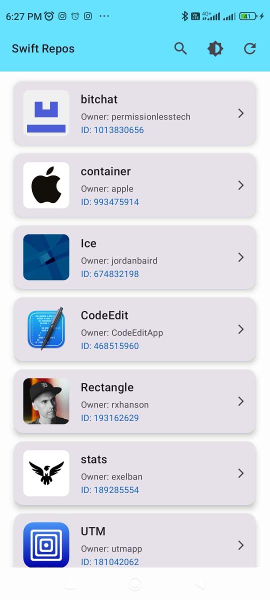

# Loyalty Juggernaut Assignment – GitHub Repos App

A modern Android application that fetches, caches, and displays trending **Swift repositories** from GitHub. Built with **Kotlin**, **Jetpack Compose**, **Hilt**, **Room**, and **Retrofit**.

---

## Download APK

You can download the latest build of the app here:

[Download APK](https://drive.google.com/file/d/1yRzF9mkbSLle6Im3Ii3oVnDEx6mU2RmE/view?usp=sharing)

> Make sure to allow installation from unknown sources if installing directly on your device.

---

## Features

- Fetch trending Swift repositories using the **GitHub REST API**.
- Offline caching using **Room Database**.
- Search repositories by **name, owner, or ID**.
- Toggle between **Light** and **Dark** themes.
- Smooth UI with **animations** and **placeholder images**.
- Handles **network errors** and provides a retry mechanism.
- Open repository details in an **in-app WebView**.

---

## Demo

You can watch the screen record of the app here:

[Watch Demo](https://drive.google.com/file/d/1kaZbcH08dRv961S-l2FkklFlnhu3Cdxf/view?usp=sharing)

---

## Screenshots

<p align="center">
  
  &nbsp;&nbsp;&nbsp;
  
</p>

---

## Architecture

The app follows **MVVM (Model-View-ViewModel)** architecture with:

- **Hilt** for dependency injection  
- **Room** for caching  
- **Retrofit + OkHttp** for network operations  

### Flow Diagram

```text
[ UI Layer (Jetpack Compose) ]
              |
              v
[ ViewModel (RepoViewModel) ]
              |
              v
[ Repository (ReposRepository) ]
              |
              v
[ Data Sources ]
    ├─ Remote API (Retrofit + OkHttp)
    └─ Local Database (Room)

```

### Layer Responsibilities

- **UI Layer (Compose)**  
  - Displays repository data in a **scrollable list** with cards.
  - Provides **search**, **theme toggle**, and **refresh** actions.
  - Handles **loading**, **empty**, and **error states** with animations.

- **ViewModel**  
  - Maintains **UI state** using `StateFlow`.
  - Observes cached data from the repository.
  - Handles **search filtering** and triggers API refresh.

- **Repository**  
  - Manages data operations from **remote API** and **local database**.
  - Provides **offline caching** for smooth user experience.
  - Handles **network errors** and exception mapping.

- **Data Sources**  
  - **Remote API:** Fetches trending Swift repositories via GitHub REST API.
  - **Local Database:** Stores repository entities using Room for offline access.

---

## Key Components

### Networking
- **Retrofit** for API calls.
- **OkHttp Interceptors** for logging and connectivity checks.
- Gracefully handles **network exceptions** and **API errors**.

### Caching
- **Room Database** stores repository data locally.
- Reduces network load and allows **offline access**.

### UI
- **Jetpack Compose** for declarative UI.
- **LazyColumn** for efficient repository listing.
- **Card** components with **fade-in images**.
- **Animated search bar** and smooth UI transitions.
- **WebView** to view repository details.

### Theme
- Custom **Light** and **Dark** themes.
- User can **toggle themes dynamically**.
- App theme **independent of system theme**.

---

## Libraries & Tools

- **Kotlin**  
- **Jetpack Compose**  
- **Hilt (Dependency Injection)**  
- **Room (Local Database)**  
- **Retrofit & OkHttp (Networking)**  
- **Coroutines & Flow (Asynchronous operations)**  
- **Gson (JSON Parsing)**  

---  

