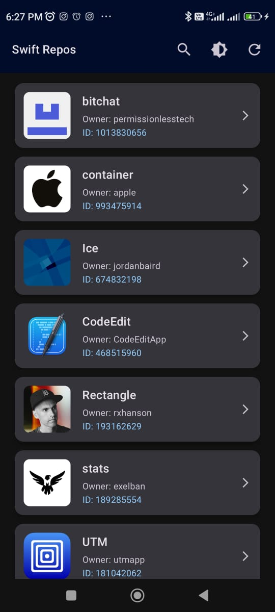

# Loyalty Juggernaut Assignment Github Repos App

A modern Android application that fetches, caches, and displays trending Swift repositories from GitHub. Built with **Kotlin**, **Jetpack Compose**, **Hilt**, **Room**, and **Retrofit**.

---

## Features

- Fetch trending Swift repositories using the GitHub REST API.
- Offline caching with Room Database.
- Search repositories by name, owner, or ID.
- Toggle between Light and Dark themes.
- Smooth UI with animations and placeholder images.
- Error handling and retry mechanism for network issues.
- Open repository in WebView on item click.

---

## Screenshots

| Light Mode | Dark Mode |
|------------|-----------|
|  |  |

---

## Architecture

The app follows **MVVM (Model-View-ViewModel)** architecture with Hilt for dependency injection.

